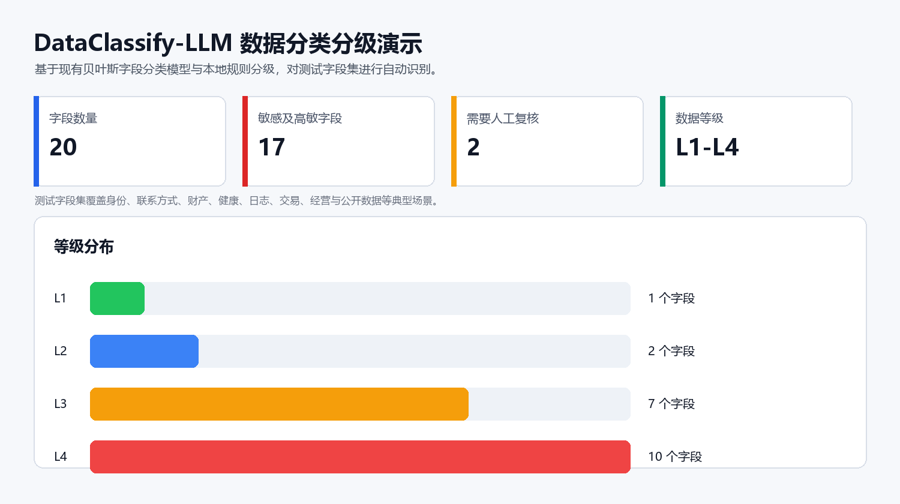
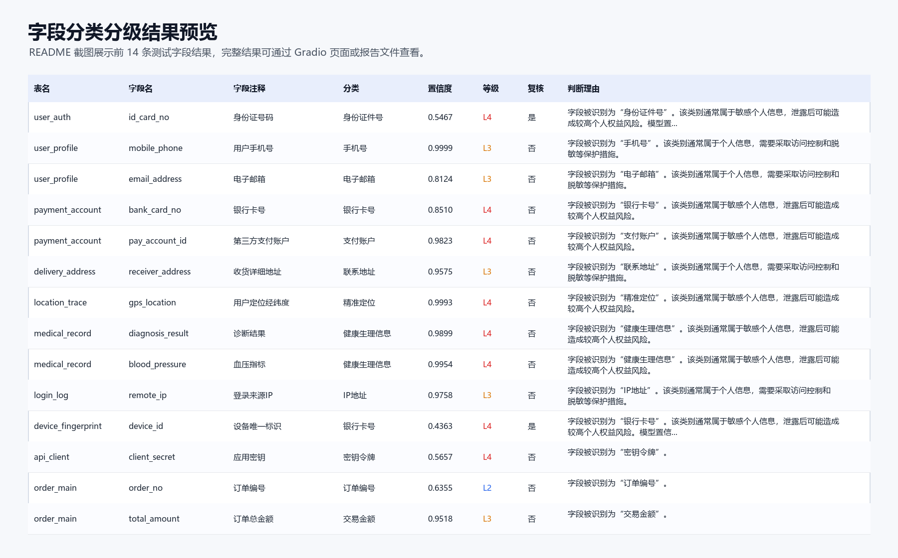

# DataClassify-LLM

字段级数据分类分级 demo。项目会读取 CSV 中的数据库字段信息，先用贝叶斯模型判断字段属于哪类数据，再用本地规则或通用大模型判断数据安全等级，最后输出分类、分级、理由和保护建议。

当前默认不需要大模型 API key，直接使用本地规则分级即可跑通完整流程。Ollama 是可选增强，用于把分级环节切换到本地大模型。

## 页面效果





## 1. 准备 Windows 环境

建议使用 Windows 10/11、PowerShell、Miniconda 或 Anaconda。

需要先安装：

- Git：https://git-scm.com/download/win
- Miniconda：https://docs.conda.io/projects/miniconda/en/latest/
- Ollama：https://ollama.com/download/windows

Ollama 不是必需项。如果只是体验基础 demo，可以先跳过 Ollama。

## 2. 下载项目

打开 PowerShell，执行：

```powershell
git clone https://github.com/hyysu/DataClassify-LLM.git
cd DataClassify-LLM
```

如果电脑没有 Git，也可以在 GitHub 页面点击 `Code` -> `Download ZIP`，解压后进入项目目录。

## 3. 创建 Python 虚拟环境

项目推荐使用 conda 虚拟环境，Python 版本为 3.11。

```powershell
conda env create -f environment.yml
conda activate data-classification
```

如果这个环境已经存在，可以更新依赖：

```powershell
conda env update -n data-classification -f environment.yml --prune
conda activate data-classification
```

检查依赖是否安装成功：

```powershell
python scripts/smoke_test.py
```

## 4. 训练贝叶斯分类模型

先训练基础字段分类模型：

```powershell
python scripts/train_model.py
```

也可以使用代码生成的合成字段数据训练模型：

```powershell
python scripts/train_synthetic.py
```

如果希望不断生成合成数据训练，直到验证集准确率达到目标：

```powershell
python scripts/train_synthetic_until_target.py --target-accuracy 0.92 --max-rounds 8
```

这个迭代训练流程会不断扩充合成训练集，用验证集判断是否停止，最终测试集只在训练结束后评估一次，避免把测试集变成调参依据。

## 5. 命令行跑一次示例分析

```powershell
python scripts/analyze_demo.py
```

运行后会生成报告文件：

- `reports/demo_report.csv`
- `reports/demo_report.json`

评估模型效果：

```powershell
python scripts/evaluate_model.py
```

## 6. 启动 Gradio 页面

```powershell
python scripts/run_gradio.py
```

然后在浏览器打开：

```text
http://127.0.0.1:7860
```

页面里可以上传字段 CSV，也可以直接点击“分析示例数据”。默认分级方式选择 `rule`，也就是本地规则分级，不需要大模型。

页面生成的 CSV、JSON、Excel 报告会保存到：

```text
reports/ui
```

## 7. 可选：接入 Ollama 本地大模型

先确认 Ollama 已安装并启动。PowerShell 中执行：

```powershell
ollama --version
```

下载一个较小的本地模型：

```powershell
ollama pull qwen2.5:1.5b
```

如果电脑性能较好，也可以使用：

```powershell
ollama pull qwen2.5:3b
```

配置当前 PowerShell 会话的 LLM 参数：

```powershell
$env:LLM_BASE_URL="http://127.0.0.1:11434/v1"
$env:LLM_API_KEY="ollama"
$env:LLM_MODEL="qwen2.5:1.5b"
```

如果你下载的是 `qwen2.5:3b`，把最后一行改成：

```powershell
$env:LLM_MODEL="qwen2.5:3b"
```

然后重新运行 Gradio：

```powershell
python scripts/run_gradio.py
```

在页面中把“分级方式”从 `rule` 切换为 `llm`，再点击分析即可调用 Ollama。没有配置 Ollama 时，请保持 `rule`。

也可以用命令行调用 LLM 分级：

```powershell
$env:PYTHONPATH="src"
python -m data_classification_tool analyze --auto-train --grader llm
```

## 8. 输入 CSV 格式

上传 CSV 建议包含这些列：

```text
table_name,table_comment,column_name,column_comment,data_type,sample_values
```

示例：

```csv
table_name,table_comment,column_name,column_comment,data_type,sample_values
user_profile,用户信息表,mobile_phone,手机号,varchar,13800001111
user_auth,实名认证表,id_card_no,身份证号码,varchar,110101199001011234
order_payment,订单支付表,pay_amount,支付金额,decimal,199.90
```

注意：真实项目中不要把原始敏感样本值发给大模型。当前特征提取模块会尽量使用格式特征、正则命中特征和统计特征，而不是依赖原始值本身。

## 9. 运行测试

```powershell
pytest
```

或：

```powershell
python -m pytest tests
```

## 10. 项目结构

```text
data/        示例数据、训练数据、标签规则
docs/        说明文档和演示图片
models/      训练后的本地模型，默认不提交到 Git
reports/     分析和评估输出，默认不提交到 Git
scripts/     常用运行脚本
src/         项目源码
tests/       自动化测试
```

## 当前能力边界

- 贝叶斯模型负责字段分类，不负责最终安全等级判断。
- 分级可以使用本地规则，也可以通过 OpenAI-compatible 接口调用 Ollama 或其他大模型。
- 当前 demo 适合验证流程和原型演示，不等同于可直接上线的企业级数据安全治理系统。
