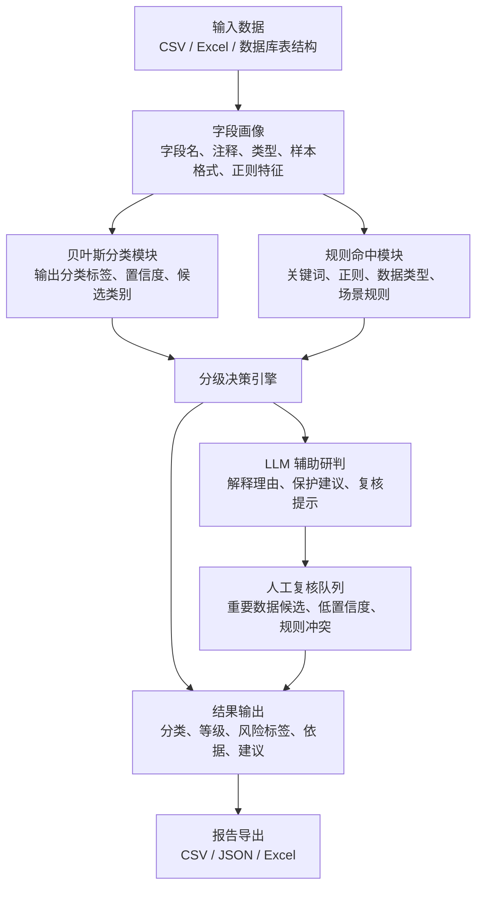

# 分类分级项目 2.0 重构设计方案

## 1. 项目重新定位

当前项目不应只定位为“字段分类 demo”，而应升级为：

> 面向数据安全治理的数据分类分级与风险识别辅助工具。

工具的目标不是替代人工做最终定性，而是完成以下工作：

1. 自动识别数据库字段、CSV/Excel 字段的数据类别。
2. 依据规则库给出初始安全等级、风险标签和保护建议。
3. 对重要数据候选、核心数据候选、规则冲突、低置信度结果标记人工复核。
4. 使用 LLM 辅助生成分级理由、风险说明、处置建议，但不让 LLM 单独决定最终等级。
5. 沉淀风险数据集，用于训练、验证、评估和专题研究。

一句话：**贝叶斯负责分类，规则库负责硬约束，LLM 负责解释和辅助研判，人工复核负责最终可信性。**

## 2. 设计依据

项目 2.0 的分类和分级设计应主要依据以下文件：

| 文件 | 对项目的作用 |
|---|---|
| 《中华人民共和国数据安全法》 | 支撑数据分类分级、重要数据保护、风险监测和事件处置 |
| 《中华人民共和国个人信息保护法》 | 支撑个人信息、敏感个人信息分类和高等级保护规则 |
| 《中华人民共和国网络安全法》 | 支撑系统安全、日志、凭据、网络安全事件相关规则 |
| 《网络数据安全管理条例》 | 支撑网络数据处理、重要数据、个人信息、风险处置规则 |
| GB/T 43697-2024《数据安全技术 数据分类分级规则》 | 支撑分类分级方法、影响对象、影响程度和分级矩阵 |
| GB/T 35273-2020《信息安全技术 个人信息安全规范》 | 支撑个人信息和敏感个人信息字段标签设计 |
| GB/T 22239-2019《信息安全技术 网络安全等级保护基本要求》 | 支撑安全控制措施建议 |
| 《生成式人工智能服务管理暂行办法》 | 支撑 AI 安全风险类型、训练数据风险、输出风险和处置要求 |
| 《工业和信息化领域数据安全管理办法（试行）》 | 支撑工业、供应链、关键零部件、运行数据分级 |
| 《碳排放权交易管理暂行条例》 | 支撑碳排放数据、碳核算、碳交易、核查报告相关风险规则 |

## 3. 总体架构



## 4. 核心设计原则

### 4.1 规则优先，模型辅助

对于强规则命中的字段，规则优先级高于 LLM。

例如：

- `id_card_no` 命中身份证正则，最低应为 L4；
- `client_secret` 命中密钥令牌规则，最低应为 L4；
- `gps_location` 命中精准定位规则，最低应为 L4；
- `mobile_phone` 命中手机号规则，最低应为 L3。

LLM 不能把这些强规则结果降到 L2。

### 4.2 重要数据和核心数据只做候选标记

工具不应直接宣称某字段就是重要数据或核心数据，而应输出：

```text
important_data_candidate
core_data_candidate
need_manual_review
```

原因是重要数据、核心数据通常需要结合行业目录、地区目录、业务场景、数据规模和影响程度综合认定。

### 4.3 分类和分级分离

分类回答：“这是什么数据？”

分级回答：“这个数据泄露、篡改、滥用后影响有多大？”

同一个分类在不同场景下可以有不同等级。例如：

| 字段 | 分类 | 场景 | 等级 |
|---|---|---|---|
| phone_number | 个人联系方式 | 单条客服记录 | L3 |
| phone_number | 个人联系方式 | 千万级用户库 | L4 候选 |
| supplier_name | 供应商信息 | 普通采购 | L3 |
| supplier_name | 供应商信息 | 关键零部件供应链 | L4 候选 |

### 4.4 LLM 输出必须受约束

LLM 只做三件事：

1. 补充解释；
2. 生成保护建议；
3. 对规则冲突或上下文不足的结果提出复核意见。

LLM 不应绕过规则库直接自由定级。

## 5. 2.0 模块设计

### 5.1 输入层

支持三类输入：

| 输入类型 | 当前状态 | 2.0 设计 |
|---|---|---|
| CSV | 已支持 | 保留，作为主要 demo 入口 |
| Excel | 部分可扩展 | 增加 Excel 字段读取 |
| 数据库表结构 | 尚未正式支持 | 后续支持 MySQL、PostgreSQL、SQLite 元数据读取 |

标准输入字段建议：

```text
table_name
table_comment
column_name
column_comment
data_type
sample_values
business_context
data_volume
source_system
department
cross_border
```

### 5.2 字段画像模块

字段画像模块不保存真实敏感样本，只生成画像。

输出示例：

```json
{
  "column_name": "id_card_no",
  "tokens": ["id", "card", "身份证", "证件号码"],
  "data_type_family": "string",
  "regex_features": ["id_card_number"],
  "sample_profile": {
    "avg_length": 18,
    "fixed_length": true,
    "mostly_numeric": true,
    "raw_values_used": false
  }
}
```

### 5.3 贝叶斯分类模块

继续保留当前 `DataFieldBayesClassifier`，但 2.0 中它只负责初始分类。

输出：

```json
{
  "predicted_category": "个人身份信息",
  "confidence": 0.94,
  "top_candidates": [
    {"category": "个人身份信息", "probability": 0.94},
    {"category": "个人基本信息", "probability": 0.03}
  ],
  "need_review": false,
  "evidence_features": ["身份证", "18位长度", "身份证正则匹配"]
}
```

### 5.4 规则命中模块

新增 `RiskRuleEngine`，读取 `data/risk_rule_catalog.csv` 或 `data/risk_rules.json`。

职责：

1. 按关键词、正则、字段类型、业务场景命中规则。
2. 输出风险标签、最低等级、依据文件、保护建议。
3. 标记强规则和人工复核规则。

输出示例：

```json
{
  "matched_rules": ["PI-SPI-001", "SYS-SECRET-001"],
  "risk_tags": ["sensitive_personal_info"],
  "minimum_level": "L4",
  "legal_basis": ["个人信息保护法", "GB/T 35273-2020"],
  "controls": ["加密存储", "脱敏展示", "访问审批"],
  "review_required": false
}
```

### 5.5 分级决策引擎

新增 `RiskGradingEngine`，统一合并贝叶斯结果、规则结果和 LLM 结果。

决策顺序：

1. 读取贝叶斯分类结果。
2. 读取规则命中结果。
3. 根据规则最低等级确定初始等级。
4. 如 LLM 给出更高等级，可以采纳。
5. 如 LLM 给出更低等级，但违反强规则，不采纳。
6. 规则冲突、低置信度、重要数据候选，进入人工复核。

伪逻辑：

```text
final_level = max(rule_minimum_level, llm_suggested_level)

if strong_rule_hit and llm_suggested_level < rule_minimum_level:
    final_level = rule_minimum_level
    need_review = true
    reason += "LLM 建议低于强规则约束，已按规则保底。"
```

### 5.6 LLM 辅助模块

LLM 输入不再只有字段信息，而应包含规则命中结果：

```json
{
  "field": "...",
  "bayes_category": "...",
  "bayes_confidence": 0.94,
  "matched_rules": ["PI-SPI-001"],
  "rule_minimum_level": "L4",
  "risk_tags": ["sensitive_personal_info"],
  "legal_basis": ["个人信息保护法", "GB/T 35273-2020"],
  "instruction": "不得把强规则命中的 L4 降为 L2。"
}
```

LLM 输出：

```json
{
  "suggested_level": "L4",
  "reason": "字段命中身份证件号码规则，属于敏感个人信息。",
  "controls": ["加密存储", "脱敏展示", "访问审批", "操作审计"],
  "review_required": false,
  "risk_summary": "泄露后可能导致身份冒用和财产损失。"
}
```

## 6. 分类标签体系 2.0

建议采用“一级分类 + 二级分类 + 风险标签”的结构。

| 一级分类 | 二级分类示例 |
|---|---|
| 个人信息 | 个人基本信息、个人联系方式、个人网络身份标识、个人教育职业信息 |
| 敏感个人信息 | 身份证件、生物识别、金融账户、健康医疗、精准定位、未成年人个人信息 |
| 组织经营信息 | 客户信息、供应商信息、合同信息、报价信息、经营分析信息 |
| 业务交易信息 | 订单信息、支付信息、发票信息、物流信息、售后信息、交易流水 |
| 系统运行与安全数据 | 系统日志、访问日志、账号权限、密钥令牌、漏洞告警、设备指纹 |
| 人工智能安全数据 | 训练数据、标注数据、提示词数据、模型输出、评测样本、风险事件记录 |
| 供应链数据 | 供应商名录、采购价格、库存数据、物流路径、关键零部件、供应中断风险 |
| 碳排放与环境数据 | 企业排放量、能源消耗、碳核算参数、碳配额、碳交易、核查报告 |
| 公共或普通业务数据 | 公开公告、公开产品信息、低敏统计数据 |
| 其他 | 无法明确归类或需要人工复核的数据 |

## 7. 分级体系 2.0

| 等级 | 名称 | 典型数据 |
|---|---|---|
| L1 | 公开或低敏数据 | 公开公告、公开产品说明、低敏统计 |
| L2 | 内部一般数据 | 普通内部流程字段、一般配置、普通状态数据 |
| L3 | 敏感数据 | 个人信息、交易数据、客户信息、供应商信息、访问日志 |
| L4 | 高敏感或重要数据候选 | 敏感个人信息、密钥凭据、精准定位、重要数据候选、关键供应链数据 |

## 8. 风险数据集设计

新增风险数据集文件：

```text
data/risk_dataset.csv
data/risk_dataset_template.xlsx
```

字段结构：

| 字段 | 用途 |
|---|---|
| record_id | 样本编号 |
| domain | personal、business、system、ai、supply_chain、carbon |
| table_name | 表名 |
| table_comment | 表说明 |
| column_name | 字段名 |
| column_comment | 字段说明 |
| data_type | 数据类型 |
| sample_profile | 样本画像 |
| regex_features | 正则特征 |
| category_level1 | 一级分类 |
| category_level2 | 二级分类 |
| risk_tags | 风险标签 |
| suggested_level | 建议等级 |
| legal_basis | 依据 |
| rule_ids | 命中规则 |
| controls | 保护建议 |
| need_manual_review | 是否人工复核 |

## 9. 规则库设计

新增规则库文件：

```text
data/risk_rule_catalog.csv
data/risk_rules.json
```

CSV 字段：

```text
rule_id
rule_name
rule_type
priority
enabled
keywords
regex_features
data_type_patterns
business_context_patterns
output_category_level1
output_category_level2
minimum_level
risk_tags
legal_basis
explanation
controls
review_required
```

规则示例：

| rule_id | rule_name | minimum_level | risk_tags |
|---|---|---|---|
| PI-SPI-001 | 身份证件号码识别 | L4 | sensitive_personal_info |
| PI-SPI-002 | 精准定位识别 | L4 | sensitive_personal_info |
| SYS-SECRET-001 | 密钥令牌识别 | L4 | credential_or_secret |
| SC-KEY-001 | 关键零部件供应链识别 | L4 | supply_chain_risk, important_data_candidate |
| CARBON-001 | 碳排放核算数据识别 | L3 | carbon_data_risk |
| AI-RISK-001 | AI 风险事件记录识别 | L4 | ai_safety_risk |

## 10. 页面 2.0 设计

Gradio 页面建议从单页表格升级为多 Tab：

### 10.1 数据分析页

- 上传 CSV/Excel；
- 选择分级方式：规则、LLM、规则 + LLM；
- 选择是否重新训练分类模型；
- 展示总字段数、L3/L4 数量、人工复核数量、重要数据候选数量。

### 10.2 结果明细页

字段级展示：

```text
字段名
字段注释
一级分类
二级分类
分类置信度
最终等级
风险标签
命中规则
依据文件
判断理由
保护建议
是否人工复核
```

### 10.3 规则命中页

展示每个字段命中的规则：

```text
rule_id
rule_name
priority
minimum_level
legal_basis
explanation
```

### 10.4 风险数据集页

用于查看、导入、导出风险数据集。

### 10.5 AI 风险事件页

用于生成 AI 风险事件报送模板：

```text
事件编号
发生时间
模型名称
风险类型
影响范围
涉及数据类别
已采取措施
是否需要报送
```

## 11. 代码结构 2.0

建议新增和调整如下结构：

```text
src/data_classification_tool/
  taxonomy.py              # 分类标签体系
  risk_rules.py            # 规则数据结构
  rule_engine.py           # 规则命中
  risk_grading.py          # 分级决策引擎
  llm_advisor.py           # LLM 辅助解释
  review.py                # 人工复核逻辑
  risk_dataset.py          # 风险数据集读写
  feature_extractor.py     # 保留并增强
  bayes_classifier.py      # 保留
  gradio_app.py            # 改造成多 Tab

data/
  taxonomy_catalog.csv
  risk_rule_catalog.csv
  risk_dataset.csv
  risk_dataset_template.xlsx
  demo_fields.csv
```

## 12. 开发路线

### 阶段一：不动大模型，先补规则库

1. 新建 `taxonomy_catalog.csv`。
2. 新建 `risk_rule_catalog.csv`。
3. 新建 `RiskRuleEngine`。
4. 让当前分级模块读取规则库。
5. 修复 LLM 把 L4 判成 L2 的问题。

### 阶段二：重构分级决策

1. 新建 `RiskGradingEngine`。
2. 实现强规则保底。
3. 实现重要数据候选、核心数据候选、人工复核标记。
4. 输出命中规则和法律依据。

### 阶段三：建设风险数据集

1. 生成风险数据集模板。
2. 录入个人信息、系统安全、供应链、碳排放、AI 风险样本。
3. 拆分训练集、验证集、测试集。
4. 用真实业务风格字段验证贝叶斯分类。

### 阶段四：升级 Gradio 页面

1. 增加规则命中展示。
2. 增加风险标签展示。
3. 增加人工复核列表。
4. 增加报告导出字段。

### 阶段五：专题研究沉淀

1. AI 安全风险类型和报送字段。
2. 供应链数据安全分类和风险规则。
3. 碳排放数据安全分类和风险规则。

## 13. 当前项目到 2.0 的迁移关系

| 当前模块 | 2.0 处理方式 |
|---|---|
| `feature_extractor.py` | 保留，增加业务场景、风险画像特征 |
| `bayes_classifier.py` | 保留，只负责分类 |
| `grader.py` | 拆分为规则分级、LLM 辅助、最终决策 |
| `field_label_catalog.csv` | 升级为 `taxonomy_catalog.csv` |
| `training_fields.csv` | 升级为风险数据集的一部分 |
| `gradio_app.py` | 改造成多 Tab 风险分析页面 |
| `synthetic_data.py` | 扩展为风险数据集合成器 |

## 14. 最小可行 2.0 版本

最小可行版本不需要一次做完全部能力，只需要完成：

1. `taxonomy_catalog.csv`
2. `risk_rule_catalog.csv`
3. `RiskRuleEngine`
4. 强规则保底分级
5. Gradio 结果表增加：
   - 风险标签；
   - 命中规则；
   - 依据文件；
   - 是否人工复核。

完成这五项后，项目就会从“模型 demo”变成“有规则依据的数据分类分级原型”。

